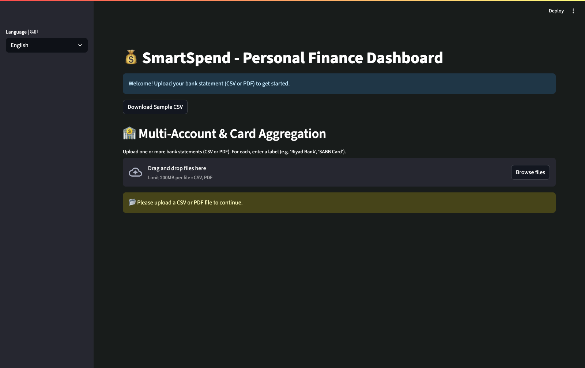

# SmartSpend: Saudi Bank Edition

SmartSpend is a bilingual (Arabic/English) personal finance dashboard for Saudi Arabia. It lets users upload bank statements (CSV or PDF), categorize transactions, analyze spending, detect recurring payments, and gain actionable financial insights.

---

## 📸 Screenshots

<!-- Place your screenshots in the /screenshots folder and update the links below -->



---

## 🚀 Features

- **Arabic & English UI**  
- **Multi-account support**  
- **CSV & PDF (Saudi bank) ingestion**  
- **Automatic & user-editable categories**  
- **Recurring payment detection**  
- **Smart insights & savings tips**  
- **Data visualization:** trends, breakdowns, predictions  
- **Exports:** Clean data to CSV/Excel  
- **Privacy:** All data processed locally

---

## 🏁 Quickstart

1. **Install requirements**
    ```bash
    pip install -r requirements.txt
    ```
2. **Run the app**
    ```bash
    streamlit run app.py
    ```
3. **Upload your bank statement (CSV/PDF) and start exploring!**

---

## 📂 Structure

```
smartspend/
  app.py
  README.md
  requirements.txt
  /screenshots/
  /src/assets/sample_statement.csv
```

---

## 🏆 Why SmartSpend?

- Built for Saudi banks & users
- User-friendly, modern, and secure
- Ready for hackathons, contests, and real-world use

---

## 📜 License

MIT

---

## 📞 Contact

- Author: Malekdevhub  
- GitHub: [Malekdevhub](https://github.com/Malekdevhub)
